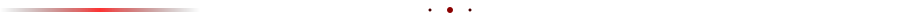

<!-- 
     ██████████████████████████████████████████████████████████
     █                                                        █
     █   ░░░ N E V E R S T A R E ░░░                         █
     █   Ghost Operator | Shell Architect | Dark Ops          █
     █                                                        █
     ██████████████████████████████████████████████████████████  
-->

<!-- ═══════════════════════ GLITCH HEADER ═══════════════════════ -->

<p align="center">
  
</p>

<!-- ═══════════════════════ ANIMATED TYPING ═══════════════════════ -->

<div align="center">

<a href="https://github.com/neverstare">

</a>

<br>

<!-- Hacker-themed dynamic banner -->
<a href="https://github.com/neverstare">
  
</a>

<br><br>

<!-- Status badges — different style -->

&nbsp;

&nbsp;


</div>

<br>



<br>

<!-- ═══════════════════════ ANIMATED TERMINAL ═══════════════════════ -->

<p align="center">
  
</p>

<br>


<br>

<!-- ═══════════════════════ KILL CHAIN ═══════════════════════ -->

<div align="center">

```
┌──────────────────────────────────────────────────────────────────────────────┐
│                                                                              │
│    ◉ REVERSE ──▸ ◉ ANALYZE ──▸ ◉ WEAPONIZE ──▸ ◉ DEPLOY ──▸ ◉ VANISH     │
│      ┊              ┊              ┊               ┊              ┊        │
│      Disassemble     Map Code       Craft           Execute        Erase    │
│      Binary          Flow           Payload         Silently       Traces   │
│                                                                              │
│    ┌─────────────────────────────────────────────────────────────────────┐   │
│    │  Reverse Eng.  : ████████████████████ ACTIVE                       │   │
│    │  Malware Dev   : ████████████████████ ARMED                        │   │
│    │  Stealth Mode  : ████████████████████ ACTIVE                       │   │
│    │  Detection     : ░░░░░░░░░░░░░░░░░░░ ZERO                         │   │
│    └─────────────────────────────────────────────────────────────────────┘   │
│                                                                              │
│    " I dissect binaries for breakfast and write implants for dinner. "       │
│                                                                              │
└──────────────────────────────────────────────────────────────────────────────┘
```

</div>

<br>


<br>

<!-- ═══════════════════════ WEAPONS VAULT ═══════════════════════ -->

<div align="center">


<br><br>

<table>
<tr>
<td align="center" width="33%">

**`⚔️ OFFENSIVE`**

<br>

<br>


<br>

```
█▓▒░ REVERSE ENG  ░▒▓█
█▓▒░ MALWARE DEV  ░▒▓█
█▓▒░ EXPLOIT DEV  ░▒▓█
```

</td>
<td align="center" width="33%">

**`🛡️ INFRASTRUCTURE`**

<br>

<br>


<br>

```
█▓▒░ SYS ADMIN    ░▒▓█
█▓▒░ CONTAINERS   ░▒▓█
█▓▒░ CLOUD SEC    ░▒▓█
```

</td>
<td align="center" width="33%">

**`🔬 RECON & TOOLS`**

<br>

<br>


<br>

```
█▓▒░ BINARY ANAL  ░▒▓█
█▓▒░ DISASSEMBLY  ░▒▓█
█▓▒░ DEBUGGING    ░▒▓█
```

</td>
</tr>
</table>

</div>

<br>


<br>

<!-- ═══════════════════════ THREAT PROFICIENCY ═══════════════════════ -->

<div align="center">


<br><br>

```
 ╔══════════════════════════════════════════════════════════════════════════╗
 ║                                                                          ║
 ║   THREAT PROFICIENCY ASSESSMENT            CLASSIFICATION: ████████████  ║
 ║   ═══════════════════════════════════════════════════════════════════     ║
 ║                                                                          ║
 ║   Reverse Eng.      ▰▰▰▰▰▰▰▰▰▰▰▰▰▰▰▰▰▰▱▱  90%   ◉ CRITICAL          ║
 ║   Malware Dev       ▰▰▰▰▰▰▰▰▰▰▰▰▰▰▰▰▰▱▱▱  85%   ◉ DANGEROUS         ║
 ║   Shell Scripting   ▰▰▰▰▰▰▰▰▰▰▰▰▰▰▰▰▰▰▰▱  95%   ◉ LETHAL            ║
 ║   Python            ▰▰▰▰▰▰▰▰▰▰▰▰▰▰▰▰▰▱▱▱  85%   ◉ DANGEROUS         ║
 ║   Linux Internals   ▰▰▰▰▰▰▰▰▰▰▰▰▰▰▰▰▰▱▱▱  85%   ◉ DANGEROUS         ║
 ║   C / Assembly      ▰▰▰▰▰▰▰▰▰▰▰▰▰▰▰▰▱▱▱▱  80%   ◉ SEVERE            ║
 ║   System Admin      ▰▰▰▰▰▰▰▰▰▰▰▰▰▰▰▱▱▱▱▱  75%   ◉ ELEVATED          ║
 ║   Cloud Security    ▰▰▰▰▰▰▰▰▰▰▰▰▰▰▱▱▱▱▱▱  70%   ◉ HIGH              ║
 ║                                                                          ║
 ║   [ SUBJECT SPECIALIZES IN BINARY ANALYSIS & IMPLANT ENGINEERING ]       ║
 ║                                                                          ║
 ╚══════════════════════════════════════════════════════════════════════════╝
```

</div>

<br>


<br>

<!-- ═══════════════════════ DEPLOYED PAYLOADS ═══════════════════════ -->

<div align="center">


<br><br>

<!-- Dynamic project cards with hacker theme -->
<a href="https://github.com/neverstare/shellswitch">
  
</a>
&nbsp;&nbsp;
<a href="https://github.com/neverstare/neverstare">
  
</a>

<br><br>

<!-- Hacker project list banner -->
<a href="https://github.com/neverstare">
  
</a>

</div>

<br>


<br>

<!-- ═══════════════════════ SURVEILLANCE DASHBOARD ═══════════════════════ -->

<div align="center">


<br>


&nbsp;

&nbsp;


<br><br>

<!-- Stats side by side -->


<br>

<!-- Language donut -->


<br><br>

<!-- Activity graph -->
<a href="https://github.com/neverstare">
  
</a>

</div>

<br>


<br>

<!-- ═══════════════════════ TROPHIES ═══════════════════════ -->

<div align="center">


<br><br>

<a href="https://github.com/ryo-ma/github-profile-trophy">
  
</a>

</div>

<br>


<br>

<!-- ═══════════════════════ CURRENT HUNTS ═══════════════════════ -->

<div align="center">


<br><br>

```
  ┌──────────────────────────────────────────────────────────────────────┐
  │                                                                      │
  │   🔬  Reverse Engineering   ▸ Tearing binaries apart in Ghidra       │
  │   🦠  Malware Development   ▸ Crafting implants & evasion payloads   │
  │   👁️  Shell Mastery         ▸ Bash ⇆ Zsh seamless switching         │
  │   💀  Binary Exploitation   ▸ Hunting bugs in compiled code          │
  │   🕷️  AV/EDR Evasion        ▸ Bypassing detection at runtime        │
  │   👻  Persistence Research  ▸ Techniques that survive the wipe       │
  │                                                                      │
  │   STATUS: All operations ACTIVE                                      │
  │   SLEEP:  ░░░░░░░░░░░░░░░░░░░░░░░░░░░░░░░░░  OFFLINE               │
  │                                                                      │
  └──────────────────────────────────────────────────────────────────────┘
```

</div>

<br>


<br>

<!-- ═══════════════════════ CONTRIBUTION SNAKE ═══════════════════════ -->

<div align="center">


<br><br>

<picture>
  <source media="(prefers-color-scheme: dark)" srcset="https://raw.githubusercontent.com/neverstare/neverstare/output/github-snake-dark.svg" />
  <source media="(prefers-color-scheme: light)" srcset="https://raw.githubusercontent.com/neverstare/neverstare/output/github-snake.svg" />
  
</picture>

</div>

<br>


<br>

<!-- ═══════════════════════ DEAD DROP ═══════════════════════ -->

<div align="center">


<br><br>

<a href="https://github.com/neverstare"></a>
&nbsp;
<a href="https://t.me/neverstare"></a>

<br><br>

```
╔════════════════════════════════════════════════════════════════════════════╗
║                                                                            ║
║      ███╗   ██╗███████╗██╗   ██╗███████╗██████╗ ███████╗████████╗         ║
║      ████╗  ██║██╔════╝██║   ██║██╔════╝██╔══██╗██╔════╝╚══██╔══╝         ║
║      ██╔██╗ ██║█████╗  ██║   ██║█████╗  ██████╔╝███████╗   ██║            ║
║      ██║╚██╗██║██╔══╝  ╚██╗ ██╔╝██╔══╝  ██╔══██╗╚════██║   ██║            ║
║      ██║ ╚████║███████╗ ╚████╔╝ ███████╗██║  ██║███████║   ██║            ║
║      ╚═╝  ╚═══╝╚══════╝  ╚═══╝  ╚══════╝╚═╝  ╚═╝╚══════╝   ╚═╝            ║
║                                                                            ║
║    ┌────────────────────────────────────────────────────────────────────┐   ║
║    │                                                                    │   ║
║    │    PROTOCOL  :  Do not stare into the abyss.                      │   ║
║    │    WARNING   :  The abyss is already staring back.                 │   ║
║    │    CONTACT   :  Dead drops & encrypted channels only.              │   ║
║    │    ETHICS    :  Responsible disclosure. Always.                    │   ║
║    │    MOTTO     :  " I was never here. "                              │   ║
║    │                                                                    │   ║
║    └────────────────────────────────────────────────────────────────────┘   ║
║                                                                            ║
╚════════════════════════════════════════════════════════════════════════════╝
```

<br>


<br>


&nbsp;

&nbsp;

&nbsp;


</div>

<br>

<!-- ═══════════════════════ ANIMATED FOOTER ═══════════════════════ -->

<p align="center">
  
</p>

<!-- 
     ░░░░░░░░░░░░░░░░░░░░░░░░░░░░░░░░░░░░░░
     ░                                      ░
     ░   You scrolled this far?             ░
     ░   ...I've been watching you          ░
     ░   the whole time.                    ░
     ░                                      ░
     ░   $ tail -f /var/log/your_session    ░
     ░   [ACCESS LOGGED]                    ░
     ░                            — 👁️      ░
     ░                                      ░
     ░░░░░░░░░░░░░░░░░░░░░░░░░░░░░░░░░░░░░░
-->
